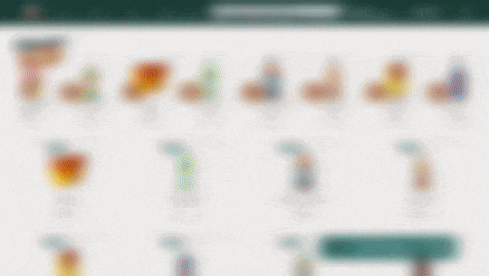

# Zé Birita 

A aplicação consiste em desenvolver tanto o back-end quanto o front-end para uma distribuidora de bebidas. Os usuários, incluindo clientes, vendedores e administradores, terão acesso ao aplicativo por meio de login, com funcionalidades distintas para cada um deles. Os clientes poderão fazer pedidos a partir de uma lista de produtos, enquanto os vendedores terão a responsabilidade de aprovar, preparar e entregar os pedidos. O administrador será responsável por gerenciar o acesso ao aplicativo.

A comunicação entre os clientes e os vendedores é essencial para o funcionamento do sistema. Os clientes farão pedidos através do "carrinho de compras", que serão aprovados, preparados e enviados pelos vendedores. 

Ao fazer um pedido, o cliente espera que ele seja exibido no painel de pedidos do vendedor após a atualização da página. Por sua vez, o cliente poderá atualizar sua página para obter informações sobre o status de seu pedido, como se ele estiver sendo preparado ou já estiver em entrega.

Os principais fluxos podem ser divididos em quatro grupos: fluxo comum (login e registro), fluxo do cliente (produtos, checkout, pedidos e detalhes do pedido), fluxo da pessoa vendedora (pedidos e controle do pedido) e validação do status do pedido (teste sem atualização em tempo real e teste com atualização em tempo real). Além disso,  o fluxo da pessoa administradora, que envolve o gerenciamento de usuários.

## Idealizadores

## Funcionalidades

- Registro e login para clientes, vendedores e administradores.
- Navegação e visualização dos produtos.
- Adição de produtos ao carrinho de compras.
- Checkout e conclusão da compra.
- Aprovação, preparo e entrega de pedidos pelos vendedores.
- Rastreamento do status dos pedidos pelos clientes.
- Gerenciamento de usuários pelos administradores.
- Atualizações em tempo real sobre o status dos pedidos.
- Programação Orientada a Objetos e princípios SOLID:
- Implementar: `Classes`, `Instâncias`, `Atributos` e `Métodos`.

##  Tecnologias utilizadas
  
### **Front-End**

  <strong> Tecnologias </strong>

 
  
- React
- Styled-components
- React-router-dom
- React-hot-toast
- React-icons
- Stylelint
- Eslint

### **Back-End**

  <strong> Tecnologias </strong>

 

- Javascript
- Node.js
- Express.js
- MySql
- Sequelize
- Programação Orientada a Objetos (POO)
- Arquitetura Model-Service-Controller (MSC)
- Multer
- JWT
- md5
- Joi
- Joi-password
- Eslint

  
## Requisitos

## `FRONT END`

  

    <strong> Requisitos Gerais </strong>
  
 

- Caso existam informações no LocalStorage referentes ao usuário, o usuário é logado automaticamente pela aplicação.
- Com o intuito de promover vendas, as quantidades dos produtos são atualizadas e armazenadas no LocalStorage.
- A experiência do usuário foi uma das maiores preocupações durante a implementação. Portanto, o tratamento de erros e as notificações ao usuário foram implementados em diversas requisições e ações realizadas pelo usuário.
- Caso o usuário esteja com o login desatualizado,expirado e inválido durante uma requisição, ele será notificado, deslogado e redirecionado para a página de login.
  

    

      <strong> Demonstração </strong>
    
 
  
  
  
  

  

    <strong> Header </strong>
  
 
  
- Links de navegação para as páginas da aplicação estão disponíveis no menu principal.
- Os textos são renderizados de forma condicional, levando em consideração se o usuário é um cliente.
- O link para a página de administração de usuários só é visível para o usuário com perfil de administrador.
- Há um link para a página de checkout, que exibe a quantidade e o valor total dos produtos selecionados.
- Existe também um link para realizar o logout da aplicação.

  

  

    <strong> SearchBar </strong>
  
 

- A aplicação possui uma SearchBar que permite que o usuário pesquise por nome e categoria de produtos.
- Quando o usuário realiza a pesquisa, se a requisição for bem-sucedida, ele é redirecionado para a página de resultados de busca, onde os parâmetros pesquisados são exibidos na URL.
- No caso de a requisição não retornar nenhum produto, o usuário é notificado sobre isso, sem ser redirecionado para outra página.

  

  

    <strong> Página de Produtos e Search </strong>
  
 

  

## `BACK END`
:construction: <strong> Documentação em construção </strong> :construction:

## Agradecimentos
Agradecemos à Trybe por nos proporcionar esta oportunidade de aprendizado e desenvolvimento de habilidades. Também agradecemos aos instrutores, colegas e mentores que nos apoiaram e orientaram durante o projeto.
